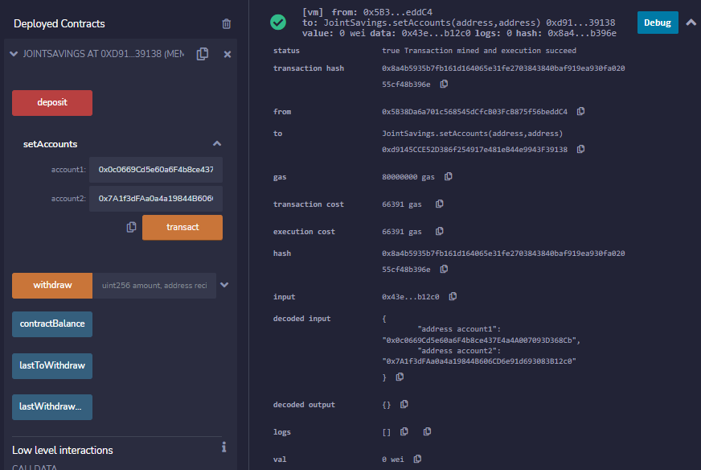
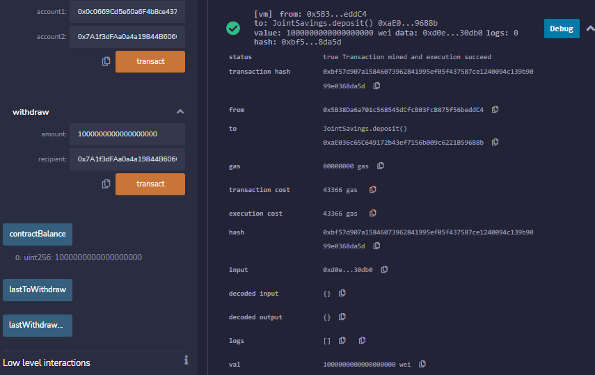
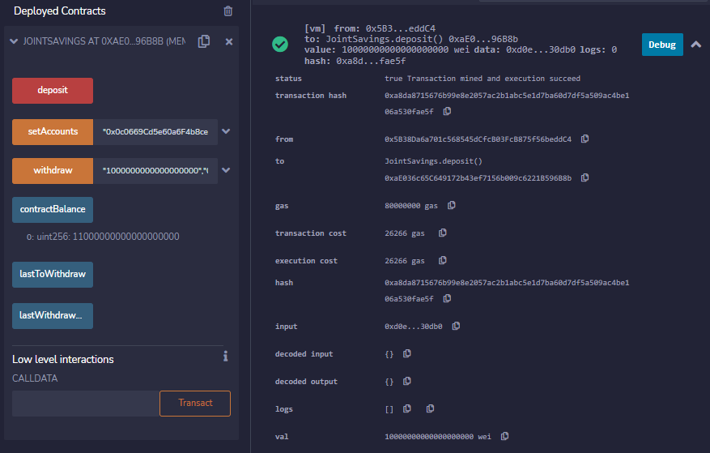
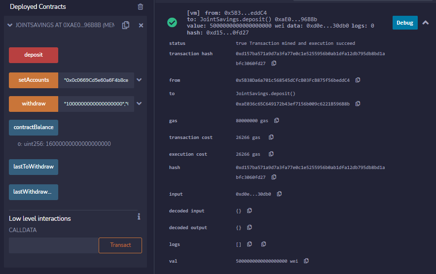
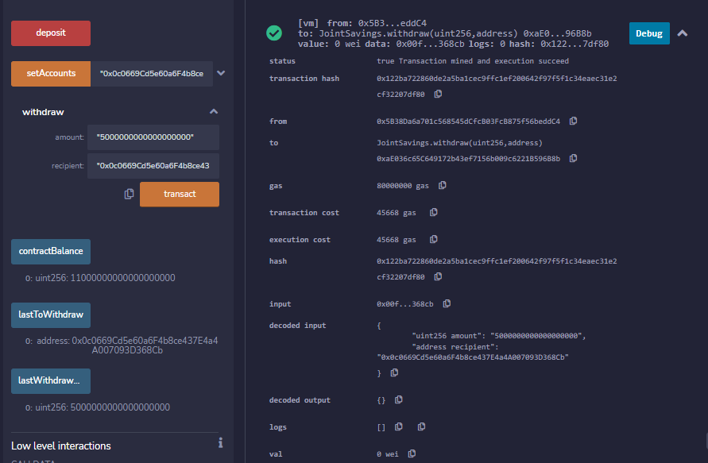

# 20: Smart Contracts with Solidity - Remix IDE, JavaScript VM
FinTech Bootcamp Module 20 Challenge

---

Our young firm operates out of our own cross-border, Ethereum-compatible blockchain that connects financial institutions. Our newest addition features this smart contract, which automates our clients' hosting of joint savings accounts. This Solidity contract accepts two user addresses, which control their respective savings account. Using ether management functions, we are able to implement the standard requirements of being able to deposit and withdraw funds from the account. 

---

## Technologies

This smart contract was written on a Windows 10 machine in the Solidity language. It is compileable in versions 0.5.0 and above, as indicated in the first line of executable code:
```
pragma solidity ^0.5.0;
```

The mock local blockchain that this contract runs on is Ganache. The addresses used are from its list of local mock wallets.

* [Ganache](https://trufflesuite.com/docs/ganache/index.html) is a personal blockchain for rapid Ethereum and Corda distributed application development. You can use Ganache across the entire development cycle; enabling you to develop, deploy, and test your dApps in a safe and deterministic environment. In this case, it was used to generate Ethereum-connected mock accounts with which to mimic transactions. All versions of Ganache are available for Windows, Mac, and Linux.

The contract's contents were developed in the online Remix IDE for its contained deployment and testing features.

* [Remix IDE](https://remix-ide.readthedocs.io/en/latest/) is an open source web and desktop application. It fosters a fast development cycle and has a rich set of plugins with intuitive GUIs. Remix is used for the entire journey of contract development as well as act as a playground for learning and teaching Ethereum.

The selected environment for deployment is the LavaScript VM (London).

* [JavaScript VM](https://vide-old.readthedocs.io/en/latest/quickstart_javascript_vm.html) is one of the 3 environments Remix can be plugged to. The JavaScript VM mode is convenient because each execution runs in your browser. Thus reloading the page will restart Remix with an empty state. The other two options, *Injected provider* and *Web3 provider*, both require the use of an external tool. (The external tool for *Web3 provider* is an Ethereum node, the tools for *Injected provider* are Mist or Metamask.)

---

## Deployed contract functionality & Hashed verification

1. Setting user account addresses:



2. Depositing 1 ether in wei & updated contractBalance:



3. Depositing 10 ether in wei & updated contractBalance:



4. Depositing 5 ether & updated contractBalance:



5. Withdrawing 5 ether into account1 & updated contractBalance, lastToWithdraw, and lastWithdrawAmount:



6. Withdrawing 10 ether into account2 & updated contractBalance, lastToWithdraw, and lastWithdrawAmount:


---

## Contributors

Brought to you by lead developer Erin Kenny at FinTech Startup X.

[Email](ekenny3@uncc.edu)

[LinkedIn](www.linkedin.com/in/e-kenny)

---

## License

MIT

License file included in repository.
